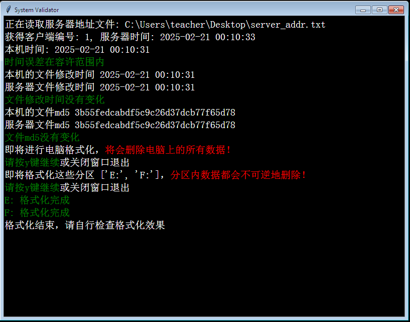
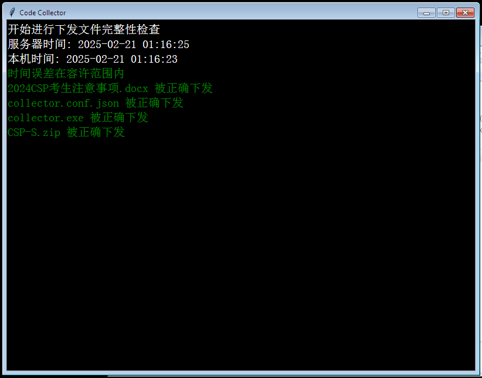
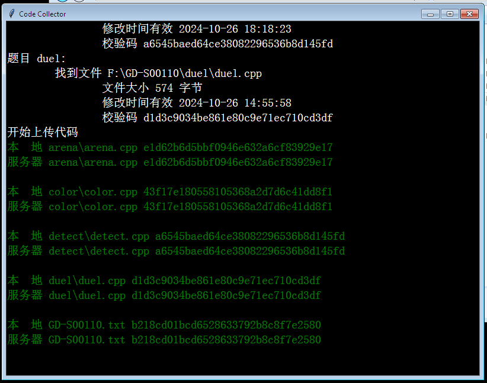

# OIcollector

为信息学竞赛（OI）设计的局域网工具。不止可以收集选手代码，还可以代监考员执行部分系统检测、清理、校对工作。

## Usage
### 下发题目前
1. 在教师机运行server.exe，获取教师机IP
  - 服务器运行的IP和端口将会保存在和server.exe相同目录下的server_addr.txt
  - 如果教师机只有一个网卡，则可以自动确定服务器IP
  - 如果教师机有多个网卡，将会提示获取IP失败。需要自行将server_addr.txt的0.0.0.0改为教师机在教室局域网的IP
2. 将validator.exe和上一步生成的server_addr.txt下发至学生机的**C盘**
3. 在教师机启动server.exe，校对好教师机时间后，按空格继续直到显示`服务器将监听：xxx.xxx.xxx.xxx:xx`
  - 若服务器启动失败，请检查是否已存在其他正在运行的服务器；如果教师机的80端口被已有程序占用，请修改server_addr.txt第二行的端口
4. 使用极域在学生机批量运行validator.exe
  - 应用程序：`cmd.exe`
  - 参数：`/C "Path\To\validator.exe"`
4. 正常情况下，程序会自动运行至`即将进行电脑格式化...`
  - 若学生机无法连接至服务器，请检查服务器IP地址是否正确，并关闭教师机的防火墙；如果仍然不能连接，请联系考点网络管理员排查局域网端口屏蔽设置
5. 在每一台电脑上按空格确认进行格式化
6. 程序会显示将要格式化的分区，再按空格确认
7. 程序输出`格式化结束，请自行检查格式化效果`时即为结束
8. 程序结束时，如果输出左侧只有绿色提示，即为完成：
  - 检查电脑时间是否正确
  - 模拟使用本套件收集代码，代码修改时间不变
  - **列出的磁盘**都已清空，但是程序只会尽力但**不保证**能检测到所有分区
  - 一切正常时的输出画面：

### 下发题目

1. 得到题目压缩包后，使用仓库内的`server.conf.json`填写比赛信息，其中`name`为本次比赛简称，示例中`name`为`CSP-S`，那么下发文件目录需要命名为`CSP-S下发文件`，且回收的代码将会存放在`CSP-S`文件夹下
2. 为每个考场准备一份考生名单`namelist<试室号>.txt`，文件中每行一个考号
3. 将文件按以下格式组织，放置到和`server.exe`同一目录下
```text
namelist1.txt
server.conf.json
server.exe
CSP-S下发文件
├─2024CSP考生注意事项.docx
├─collector.exe
├─CSP-S.zip
```
4. **先运行一次**`server.exe`，在下发文件中生成`collector.conf.json`
5. **再**将下发文件的文件夹下的文件下发到每一台学生机上

### 核对下发文件完整性
1. 在教师机运行服务器`server.exe`
2. 使用极域在学生机批量运行`collector.exe`
  - 应用程序：`cmd.exe`
  - 参数：`/C "Path\To\collector.exe"`
3. 程序将会检查学生机和服务器的连通性、学生机时间、下发文件的完整性，一切正常时程序输出如下：

### 回收代码
1. 在教师机运行服务器`server.exe`
2. **在设定的比赛结束时间5分钟后**，运行学生机上的`collector.exe`
  - 回收的代码保存在`server.exe`路径下以比赛名称命名的目录
  - 如果有考生写错考号导致考号重复，服务器将拒绝重复的代码提交，请人工核对后自行删除收集目录下的考生代码和`checksum/考号.txt`
  - 一切正常时的程序输出如下：

## Build
```bash
set CONDA_FORCE_32BIT=1
conda env create -n OIcollector -f environment.yml
conda activate OIcollector
./build.ps1
```
生成的可执行文件位于 dist/ 目录下

## Develop Notes
仓库目录结构

### 公用模块文件
- collector_conf.py：读写collector配置文件
- communicate.py：连接服务器，（解）压缩文件
- console.py：使用tk实现的彩色命令行，不使用系统命令行以避免编码和颜色问题
- utils.py：获取程序路径，获取文件信息，md5校验

### 程序主体文件
#### collector.py
代码收集程序，打包为 collector.exe
- Part1：读取配置文件
- Part2：比赛开始前校验系统时间和下发文件
- Part3：识别选手代码并记录文件信息
- Part4：比赛结束后提交代码文件

#### server.py
服务器，打包为 server.exe
- Part1：读取服务器地址配置 / 自动检测服务器地址
- Part2, Part2_handle_client：和validator交互
- Part3：检查比赛配置和下发文件，生成collector的配置文件
- Part4：向collector发送下发文件信息
- Part5, Part5_handle_client：回收与校验代码文件
- Part5_screen：实时更新代码回收情况

#### validator.py
系统环境检查工具，打包为 validator.exe

### 示例文件
- namelist1.txt：考生名单示例
- server.conf.json：比赛配置文件示例
- server_addr.txt：服务器监听地址示例

### 构建文件
- build.ps1：构建脚本
- environment.yml：conda环境记录